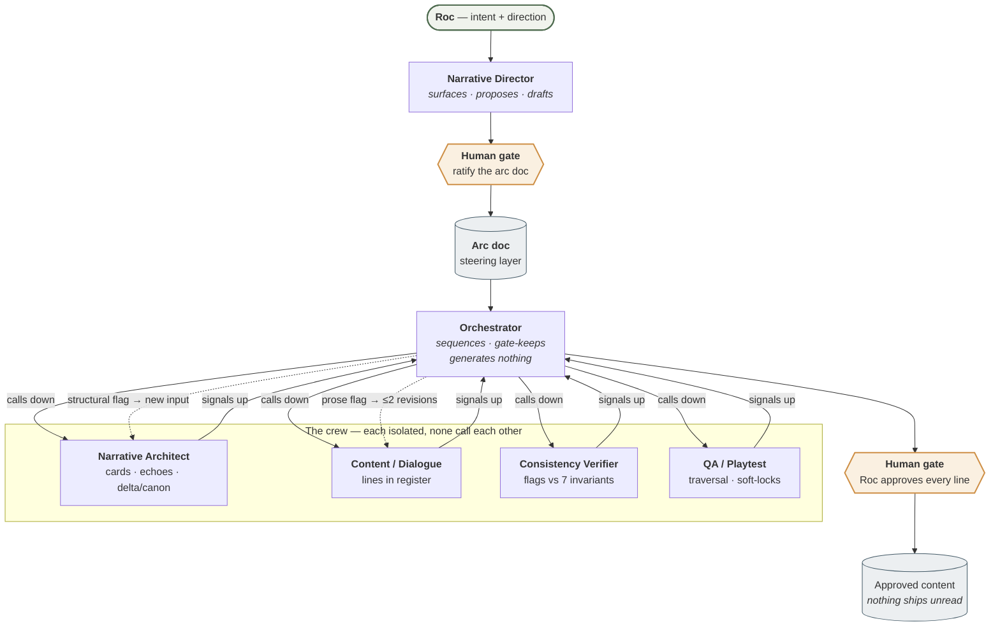

# Festival of Souls — Assignment 03

Assignment 03 for [Festival of Souls](gdd/01-concept.md), a cozy roguelite point-and-click adventure. 
## The game, briefly

You play a mage who arrives in a town before the Festival of Souls — a night when the Lantern Arch lights the way for souls to return so their loved ones can remember them. You forage, craft, learn folk magic, and build bonds across many festivals in one life. Starting a new life reshuffles every soul's role in town (essence and personality stay fixed), so the same cast tells a different story each time. Festival night resolves as a spectrum — Quiet, Warm, Grand, and a rare top tier — driven by how much of the town's collective work got done and which bonds got deepened. There's no hard-lose: every festival ends with something.

Full details live in [`gdd/`](gdd/CONTEXT.md), starting with [`01-concept.md`](gdd/01-concept.md).
# Assignment 03 BUILD AN AGENT CREW — runnable role prompts

The dev crew as **runnable role prompts**, one per agent. Each is handed to an isolated subagent so it has only its role's context and returns a typed output.

| Agent | File | Feature | Stage(s) |
|---|---|---|---|
| **Narrative Director** | [`narrative-director.md`](narrative-director.md) | Steering — surfaces corpus lore, proposes the arc-doc fields + generative tables, drafts the arc doc for ratification | 1 (Arc) |
| **Orchestrator** | [`orchestrator.md`](orchestrator.md) | Sequencing + gate-keeping (the run-driver protocol, not a subagent) | all |
| **Narrative Architect** | [`narrative-architect.md`](narrative-architect.md) | Structure — persona cards, echo map, delta/canon | 2, 6 |
| **Content / Dialogue** | [`content-dialogue.md`](content-dialogue.md) | All player-facing text, one slot per call, in register | 2, 6 |
| **Consistency Verifier** | [`consistency-verifier.md`](consistency-verifier.md) | Flags each batch vs the 7 invariants + register; flags only | all |
| **QA / Playtest** | [`qa-playtest.md`](qa-playtest.md) | Traversal & functionality; flags only (light until a scene graph exists) | 6–7 |

> NOTE: this is just the agent roles, full pipeline calls these from the main game project folder

## The flow — call down, signal up

**Reading it:** every arrow into a worker is a *prepared input*; every arrow out is a *typed output*. 

## The two rules every agent obeys

- **Call down, signal up.** Each agent takes a prepared input from the Orchestrator and returns a typed output. Workers never call each other.
- **The human gate is at the output.** Roc approves; nothing ships unread. The Director's arc doc and the Architect's cards/echoes are hard-gated before they propagate.

## Director vs Architect (the easy-to-confuse pair)

The **Narrative Director** sets *direction* (the arc doc — where the story is going) and never decides for Roc — it surfaces, proposes, drafts. The **Narrative Architect** builds *structure* (cards, echoes, scene graph) *from* the ratified arc doc. Director = showrunner; Architect = blueprint.

## Running a stage

The Orchestrator (Claude) frames the stage, hands each worker its bundle in sequence, collects typed outputs, routes flags (prose → Content ≤2 revisions; structural → Architect), and surfaces the gate. 

The above is the architecture and in `content-stages.md` is the flow during actual use for content creation.

## Example final content

Tables in `gdd/04-magic-system` and `gdd/07-cast` were made with this pipeline

#### Deep souls (3)

Each embodies a different *theory of belonging* the player weighs.

| Soul | Essence — want + behavior | Conviction | Recognition hook | Arc |
|------|---------------------------|-----------|------------------|-----|
| **The Keeper** *(working name: Mara)* | Belonging is *tended*: keep the festival — and the connection it anchors — from slipping into the past. Tends the anchor-spot compulsively, keeps a drawer of unclaimed objects and a corner "set for two," mends small broken things unasked, speaks of the place in the past tense. | Won't leave, won't let the tradition lapse or the anchor be moved — leaving = admitting the loss is final. *(The child's whistle in the drawer is not for sale.)* | Always finds the beauty in things — most in what's passing. | Clutch → transform: the bond *re-forms*; loss isn't permanent. |
| **Toby** — the Giver *(m)* | Belonging is *earned by being needed*. **Behavior cluster:** wants to be kept and believes keeping must be earned; reads the room for who is short of what and supplies it before being asked; converts anything given to him into a debt he repays in goods. Deflects to the unfinished task in the room. Exact about other people's quantities and timings, vague about his own. Warmth arrives as anticipation — the thing handed over a beat before it's reached for, and never explained. *Generated and gated through the crew, 2026-07-25; full card in [`../pipeline-runs/2026-07-25-giver/giver-persona-card.md`](../pipeline-runs/2026-07-25-giver/giver-persona-card.md).* | He will not accept care he has not paid for. | Always the one who sees how people connect. | Can't receive → can: being *claimed* unearned frees him; the player's "I see you" is the corrective. |
| **Ilsa** — the Kinbound *(f)* | Belonging is *given*: blood, family above all. **Behavior cluster:** wants her people gathered where she can see them, and holds that being hers is a fact rather than an achievement. Sets places before anyone answers, counts arrivals against a number she never says, and quietly covers a gap so nobody has to remark on it. Deflects attention onto *placement* — a chair pulled out, a spot cleared. Exact across long spans (lineage, years, whose table this is), loose across recent ones (what was promised, when, by whom) — which is precisely what lets an absence go unexamined. Warmth arrives as **inclusion**: the plate is down before anyone said you were coming, and nobody is told it was set for them. *Generated and gated through the crew, 2026-07-25; full card in [`../pipeline-runs/2026-07-25-kinbound/ilsa-persona-card.md`](../pipeline-runs/2026-07-25-kinbound/ilsa-persona-card.md).* | Family above all — loyal to blood, and slow to accept that loyalty runs both ways. | Always gathers people to a table. | *Blood is given → blood is tended.* Stays blood-first; learns only that a bond you were handed does not hold itself up. **Never arrives at chosen-family** — that stays the Found-Family Keeper's stance, and the village keeps arguing. The world still re-deals blood each life, and the Kinbound still never learns *that*. |

#### Texture souls (5) — social-only, one salient signal each, no deep profile

They counter-voice the deep trio so the whole village argues *"what is belonging?"* from every corner.

| Soul | Belonging-stance | One salient signal |
|---------------------|------------------|--------------------|
| **Nell** — the Content Server *(m)* | Needed — and at peace with it (a counter-voice to the Giver) | Hums while working; never keeps score. |
| **Juno** — the Found-Family Keeper *(f)* | Belonging is who you *choose* (counter-voice to the Kinbound; the game's own thesis) | Her "family" is a patchwork of unrelated people who all found each other. Advocate for "found family". |
| **Linnet** — Half of a Pair *(f)* | The one bond, out of reach — soulmates split by timing (the pairing-mirror) | Keeps a small habit for someone now married to another — a saved seat, a route past their window. |
| **Pip** — the Wonder-Seeker *(m)* | Belonging is in shared wonder, out there to find | Drags people to see small marvels; always mid-discovery. |
| **Bex** — the Rule-Breaker *(m)* | Says "you belong" plainly — the authored exception | Names the feeling out loud where everyone else deflects. |

#### Worked run: ignite × 7 receivers (2026-07-26)

`ignite` was run for real through the narrative crew against seven receivers, to prove receiver-determined outcomes end-to-end rather than as a two-item example. Full trail: [`../pipeline-runs/2026-07-26-ignite-trace/`](../pipeline-runs/2026-07-26-ignite-trace/); the pipeline-coordination read of the same run is in [`11-ai-agents-and-pipeline.md`](11-ai-agents-and-pipeline.md).

| Receiver | Outcome | Reaction |
|---|---|---|
| Stick | Catches | **[action]** The stick catches at the tip and holds a small, steady flame. |
| Hedge | Catches, clears the obstacle | **[action]** The hedge catches along its dry inner branches. Smoke rises first, then the flame burns through, opening the path it had blocked. |
| Furnace | State-dependent | **[action]** Unlit, stocked: the banked fuel catches and the furnace lights, draft picking up. Already lit: nothing changes — the furnace is already burning. |
| Bread | Scorches, does not catch | **[action]** The crust blackens and curls at the edges; the loaf is ruined, no flame catches. **If Toby is present:** "What did you do that for?" |
| Cat | No physical effect | **[action]** The spell's light washes over the cat's fur and fades without catching. The cat flattens, ears back, bolts under the fence, and stops. It watches from there, then bends to groom its ruffled fur. |
| Toby (direct cast) | No physical effect | "Save that for the oven." |
| Ilsa (direct cast) | No physical effect | *(null — no reaction)* |

This run generalizes the existing person-rule: **living receivers — souls and creatures alike — never catch; ignite's physical outcome attaches only to inert material.**
