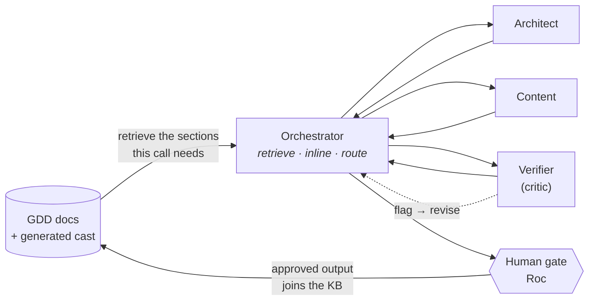

# Festival of Souls — Dynamic Content Pipeline (Assignment 04)

**Game: _Festival of Souls_** — a cozy roguelite point-and-click adventure. You play a mage who arrives in a town before the Festival of Souls, a night when the Lantern Arch lights the way for the dead to return so their loved ones can remember them. Each new life reshuffles every soul's role in town while their essence stays fixed, so the same cast tells a different story every run.

This pipeline generates the game's narrative and reactive content **from the game's own design docs**, so the output sounds like this town — not a generic fantasy village.

---

## TL;DR — the three questions the assignment asks

- **What content did I generate?** Three things the game specifically needed: **soul persona cards**, **in-register scene dialogue**, and **spell-reaction beats** (what happens when you cast a spell at the world). All produced by the crew, all gated by me.
- **Does it sound like my game?** Yes — and the test is distinctness: two souls (Toby, Ilsa) come out reading as two different people, not one archetype in two hats. Details under [Voice judgment](#does-it-sound-like-my-game-voice-judgment).
- **What did the critic catch?** It caught the writer **inventing a relationship between two souls that isn't in the game's canon** (`knowledge_travels`) and blocked it until it was rewritten. Shown in full under [What the critic caught](#what-the-critic-caught-consistency-checking).

---

## The pipeline (and how to run it)

It's an **LLM-assisted workflow**, not a script. Five roles:

- **Orchestrator** — retrieves the exact GDD sections each worker needs, hands them down, routes flags, holds the human gate. Generates nothing.
- **Narrative Architect** — turns a locked soul seed into a persona card + echo template.
- **Content / Dialogue** — writes the player-facing lines, in register.
- **Consistency Verifier** — the critic. Checks every batch against the game's invariants and flags. Never rewrites.
- **QA** — walks the result for structural/logic gaps.

**Retrieval = the Orchestrator pulling the relevant GDD sections and inlining them into each agent's prompt** (no vector store; retrieval is selective and by-section). Approved output is written back to the cast, so later runs retrieve *it* too — the knowledge base grows as it goes.

**To run it:** paste [`2026-07-25-giver/phase-2-prompt.md`](2026-07-25-giver/phase-2-prompt.md) into a fresh Claude session. It's self-contained and reproduces the Giver run end to end.

**It runs — proof:**

*The model-selection benchmark executing — 10 agents, completed, no errors.*

*The `ignite × 7` run — 13 agent invocations, each **zero tool calls** (spec inlined, not fetched), stopping at the human gate.*

---

## Knowledge base — the game docs it reads (Game-Anchored Source)

Every generation is anchored to real _Festival of Souls_ design docs — no placeholder lore:

| Doc | What it supplies |
|---|---|
| GDD v5 **§6.3** (cast) | Each soul's **locked essence** — the belonging-stance the whole card is built from |
| `arc-festival-slice.md` | The **arc doc** — World Truths, the arc question, per-occupation mishaps, anti-goals |
| `register.md` | The **voice contract** — one clause, plain, 40-word ceiling, deflect-don't-name |
| `guardrails.md` | The **invariant checklist** the critic enforces |
| `persona-card-schema.md`, `echo-template-schema.md` | Output shapes |
| **The generated cast itself** | Prior approved cards (Toby, Ilsa) become retrievable context for later runs |

---

## Three content types the game needed (Content Fit)

| Content type | The gap — "my game was thin on…" | What the crew produced |
|---|---|---|
| **Soul persona cards** | The GDD named 8 souls but defined each in a single sentence. You can't generate consistent behavior from a sentence — the game had **no behavioral character bibles**. | Full cards for **Toby** (the Giver) and **Ilsa** (the Kinbound): essence, orthogonal trait axes, voice register, canon flags. → [`2026-07-25-giver/giver-persona-card.md`](2026-07-25-giver/giver-persona-card.md), [`2026-07-25-kinbound/ilsa-persona-card.md`](2026-07-25-kinbound/ilsa-persona-card.md) |
| **In-register scene dialogue** | §6.3 was a **stub** — the game had almost **no actual player-facing lines** in the town's voice. | The `bakery-feast-dough` scene: six lines in Toby's register, each carrying his essence without naming it. → [`giver-persona-card.md`](2026-07-25-giver/giver-persona-card.md#scene--bakery-feast-dough) |
| **Spell-reaction beats** | The magic system named spells but not **what the world does when you cast one** — the game was thin on **reactive/systemic content**. | `ignite × 7 receivers` — stick, hedge, furnace, bread, cat, Toby, Ilsa, each resolved by class. → [`2026-07-26-ignite-trace/`](2026-07-26-ignite-trace/RESULTS.md) |

---

## Retrieval → output, side by side (RAG)

Three cases showing the generated output reflects the retrieved context:

**1 — GDD essence → persona card.** Retrieving the locked essence produces a card that restates it in the schema's shape, not generic character text.

| Query | Retrieved chunk (GDD v5 §6.3, Toby) | Output (`essence_descriptor`) |
|---|---|---|
| Build Toby's persona card | *"Belonging is earned by being needed. Manufactures indispensability, over-gives, cannot receive — sees the whole web of connection between people yet will not be a receiver in it."* | *"Wants to be kept, and believes keeping must be earned. Manufactures need for himself: sees how everyone in a room connects, supplies what each is short of before asking, and converts anything given to him into a debt he pays back…"* |

**2 — Voice contract → dialogue.** Retrieving `register.md` constrains the line's *form*, not just its content.

| Query | Retrieved chunk (`register.md`) | Output (line 01) |
|---|---|---|
| Write Toby's opening line for the flat-dough scene | *"One clause where possible… weight lands on a short trailing clause… deflect, do not name… 40-word ceiling absolute."* | *"Dough went flat overnight. Forty loaves short if the whole square turns out. Pass me the starter."* (17 words; distress rerouted into logistics; never named) |

**3 — Generated cast → reaction (retrieving the pipeline's own output).** The clearest case: casting `ignite` at a soul retrieves **that soul's persona card**, and the *retrieved card determines the output* — including the decision **not to generate**.

| Query | Retrieved chunk (generated card) | Output |
|---|---|---|
| Player casts `ignite` at **Toby** | `deflection_target`: *"the unfinished task in the room"* | *"Save that for the oven."* — deflects the spell onto a real task |
| Player casts `ignite` at **Ilsa** | `canon_flag`: *she is never converted; belonging is never a payout for an act* | **`null` — no reaction.** Any inclusion line would contradict the retrieved canon, so the correct output is silence |

Same spell, two souls, two correctly different results — driven entirely by what was retrieved.

---

## What the critic caught (Consistency Checking)

The **Consistency Verifier** caught a **lore break** — the writer invented a standing relationship between two souls that the game's canon (the NPC codex) doesn't contain — and blocked it. Shown, not claimed:

**1 — Flagged.** The first version of line `toby-dough-02` asserted a fixed relational fact about two named souls that isn't in the cast canon.

> **Verifier flag** — `knowledge_travels`: *"Stated a standing relational fact about two souls outside the NPC codex."*

**2 — Routed.** The Orchestrator sent it back to Content as a revision (the writer never sees the critic directly — flags route up and back down).

**3 — Corrected & approved.** Rewritten to supply a shortfall without inventing canon:

> *"Smith's out of salt; tuck a measure in with his loaves and call it bakery weight."*
> `speaker_intent`: supplies a shortfall nobody named and mislabels the gift as routine measure so no thanks can attach.

The line now expresses Toby's essence (unasked-for giving, debt foreclosed) using only facts already in canon. Full trail: [`run-log.md`](2026-07-25-giver/run-log.md).

> The critic also caught a **tone drift** that survived every structural check: a receiving line that was flat, short, and technically correct but read *"brusque and unwarm."* That one only surfaced at the human gate, which earned a new invariant — **warmth is invariant across the voice spread** (see below).

---

## Does it sound like my game? (Voice judgment)

**Yes — the evidence is distinctness.** The risk with generated casts is that everyone comes out as the same character wearing different jobs. Two souls run through the pipeline came out genuinely different:

- **Toby's** engine is **tempo** — fast, outward, animated, his lines collapsing to seven words the moment attention turns back on him.
- **Ilsa's** engine is **grammar** — uniform flat declaratives, her essence carried by an unfinished motion rather than a shortened line.

He converts gifts into debts; she converts absences into arrangements. Their trait axes differ *in kind*, and the distinctness check against a third soul (Juno) passed on every line.

**A concrete tweak I made to improve game-fit:** the **voice-register spread.** The first run passed Toby's voice as a **binary** — `"ANIMATED, not monotone"` — and every model missed the target. I re-cut it as a **spread**: *70% animated, with the asymmetry stated* (animated when attention points outward, flat and short when it turns back on him). Passing it as a spread instead of a switch landed on the first pass — visible in word count alone: outward lines 16–17 words, receiving lines 5–7.

That fix exposed a deeper one. A line can satisfy the whole spread and still be cold, so a second rule was added to the retrieval bundle: **warmth is invariant across the spread — the spread governs tempo and uptake only, never warmth.** On the next soul, the cold-line defect simply never appeared.

---

## Where to look (evidence)

| File | What it shows |
|---|---|
| [`2026-07-25-giver/phase-2-prompt.md`](2026-07-25-giver/phase-2-prompt.md) | **The runnable pipeline** — paste into a fresh session |
| [`2026-07-25-giver/run-log.md`](2026-07-25-giver/run-log.md) | Call-by-call trail: every retrieval, every critic flag, every revision, the gate |
| [`2026-07-25-giver/giver-persona-card.md`](2026-07-25-giver/giver-persona-card.md) | The approved Toby card + scene dialogue |
| [`2026-07-25-kinbound/ilsa-persona-card.md`](2026-07-25-kinbound/ilsa-persona-card.md) | The second soul — the distinctness control |
| [`2026-07-26-ignite-trace/`](2026-07-26-ignite-trace/RESULTS.md) | The `ignite × 7` reactive-content run |
| [`2026-07-25-giver/RESULTS.md`](2026-07-25-giver/RESULTS.md) | How the model config per role was chosen (the benchmark) |
