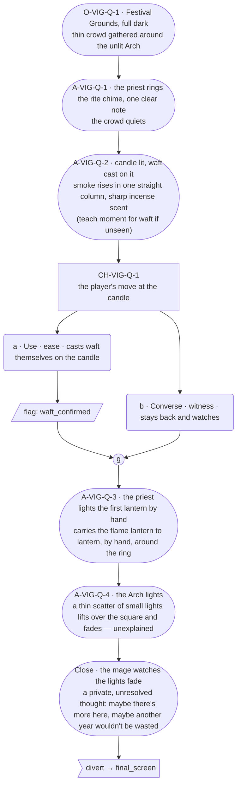

# VIG-quiet — Festival Vignette, Quiet tier

**Not a normal ENC/NGT/SPB scene.** This is the game's actual **Festival
Vignette** (screen `T9` in `tools/resolver/data/screen-specs.json`), the
one-way terminal beat that fires once every festival-night NPC scene is
complete (or the player starts it early), and diverts straight to the
**Final Screen** (`FS`) — never back into normal play. Built and wired in
`plans/2026-08-01-festival-night-transition-plan.md` (2026-08-01); its prose
has been placeholder-only until now, tagged `#screen:T9` in the hand-authored
`festival_vignette` ink knot. **This structure's close diverts to
`final_screen`, not to the main menu directly** — the continue/main-menu
choice lives one screen downstream, on `FS`.

**Tier:** Quiet — one festival goal completed this cycle (`FestivalScore.ts`'s
`tierFor`). Per `gdd/00-world-bible.md`: "a modest festival, few souls turn
out, the square is half-full, the light low and warm... the least the
remembering can show."

## Part A — Mini Architect Brief

**What this scene carries:** the priest's rite (unnamed — ritual distance,
not a carded soul's scene), staged in full for the first time this cycle:
rite chime, candle, `waft`, lantern succession. This is also the player's
teach moment for `waft` if they haven't seen it cast yet, matching the
spell's own `learn_source` (watching the priest) and giving them a real
choice about `confirm_action` (casting it themselves) right here.

**Beats:** 7 — crowd/setting, the chime, the candle+waft (with the teach
moment), one choice point (cast waft yourself, or hold back and watch),
lantern succession lighting, the tier's own unexplained magic display, the
mage's closing reflection. No gather back into play — the scene closes on
a straight divert to `final_screen`.

**Constraint worth naming — the truth-guard.** Nothing in this scene, in
the priest's staging or the closing reflection, may explain, name, or
gesture at what the display actually is (guardrails check 7's banned
vocabulary — remember/memory/forget — binds absolutely here, this is the
single highest-risk scene in the whole project for that leak). The display
is watched, felt, and never narrated as anything but beautiful and
unexplained. The mage's closing thought may wonder "there's more to learn
here" — it may never guess correctly what that is.

---

## Part B — Choice Designer Output

### Content block

**Incoming state (O-VIG-Q-1):** The Festival Grounds at full dark, torches
and a few strung lanterns unlit still. The crowd is thin — a scattering of
townsfolk, not the whole town — standing loosely around a raised stone
circle at the square's center, where the unlit Lantern Arch waits.

**A-VIG-Q-1 (action beat, no choice):** The priest — no name given, ritual
distance held throughout — steps into the circle and lifts a small worn
brass chime on a leather strap. One clear, brief note. The murmuring crowd
quiets. *(The rite chime, per `key_rite_chime`'s own record — brass, shaken,
not struck.)*

**A-VIG-Q-2 (action beat, no choice — the teach moment):** The priest lights
a single candle from a taper, then casts `waft` over the flame. The smoke
doesn't scatter — it gathers and rises in one straight column, unmoved by
the night air, and the incense in it carries out over the crowd, sharp and
clean and a little bracing, the kind of smell that wakes something up in
the chest. *(Component table: `item_grass` + `item_tree_sap`, per
`content/magic/waft.json` — kept in context, not stated on-page.)* If the
player hasn't seen `waft` cast before, this is where they learn it —
`learn_source` satisfied by watching.

**CH-VIG-Q-1 (2 options, ungated — the one choice point):**
- **a · Use · ease** — `surface_action`: steps forward and casts `waft`
  themselves, on the still-smoking candle, confirming the spell for real
  (`confirm_action`, per the spell's own record). Records
  `knowledge_flag(waft_confirmed)`. The priest doesn't remark on it — one
  more column of smoke joins the first, briefly, then settles back to one.
- **b · Converse · witness** — `player_line`: stays where they are and
  watches. No flag — they've still learned the spell exists (`learn_source`
  satisfied either way), just haven't confirmed it here. A legitimate,
  un-punished read; nothing about the rest of the scene changes because of
  which is picked.

Converges at **J-VIG-Q-1**.

**A-VIG-Q-3 (action beat, no choice):** The priest touches the candle's
flame to the first lantern at the circle's edge. It catches. By hand, one
at a time, unhurried, the priest carries the flame lantern to lantern
around the square's ring — not the sudden lantern-to-lantern leap the
Grand-tier rite will show later cycles, just an ordinary, patient lighting,
each lantern catching from the one before it until the ring is lit end to
end.

**A-VIG-Q-4 (the tier's own display, no choice, unexplained):** As the last
lantern catches, the Lantern Arch itself lights — and above the square, a
thin scatter of small lights lifts into the dark and fades, there and gone,
like sparks that never had to have come from anywhere. Nobody explains it.
Nobody seems to expect an explanation. It is simply the least the night
can show, and the crowd watches it the way people watch anything that
happens once a year.

**Close — the mage's reflection (no choice):** [action] The mage stands at
the ring's edge, watching the last of the drifting lights fade. Whatever
that was, it wasn't in any of the folk magic they came here to learn — and
they find themselves thinking, unbidden, that there might be something
else here worth staying for. Maybe another year in Hearthlight wouldn't be
wasted. The thought passes, warm and unresolved, and the scene closes.

**Divert:** `-> final_screen`. No gather, no return to play — this is the
scene's whole job.

**Action-slot ratio:** 4 action/object beats (setup, chime, candle+waft,
lantern succession, display, close — six total non-choice beats) against
one 2-option choice node — deliberately action-heavy, since this is a
watched ritual, not a conversation, and the register's own rule (roughly
one action/object slot per 3-5 dialogue slots) inverts naturally for a
scene built around watching rather than talking.

**Long-run placement:** None marked. This is description-driven, not a
soul's licensed long dialogue run — no card's exception applies to an
unnamed ritual figure or the mage's own narration.

**Equal weight:** Casting waft yourself confirms the spell now; holding
back just means confirming it later, elsewhere. Neither is the "right"
way to experience the rite — the choice is about participation, not
correctness.

### Mermaid graph

**Self-verify:** mermaid parses (`flowchart TD`, no id collisions, stadium
shapes for every non-choice beat, correct rounded/parallelogram/hexagon-free
choice shapes since this scene has no gates). Every option/flag appears
once, prose and diagram match ids exactly. Genuine gather at `J1` before
the scene continues to its terminal divert. No sanctioned-long-run claimed.
No World Truth stated; no memory/remember vocabulary anywhere; the display
is shown, never explained, at any point in the text.
